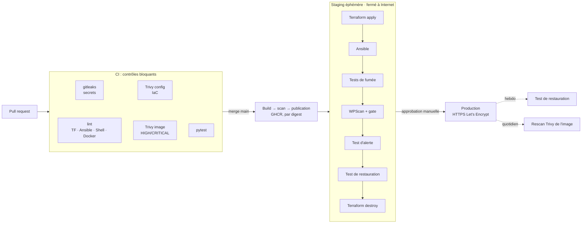

# Pipeline DevSecOps — WordPress sur Azure

[](https://github.com/Pap3rClips/devsecops-wordpress-azure/actions/workflows/ci.yml)
[](https://github.com/Pap3rClips/devsecops-wordpress-azure/actions/workflows/cd.yml)
[](https://github.com/Pap3rClips/devsecops-wordpress-azure/actions/workflows/restore-test.yml)

Une chaîne de déploiement où **la sécurité est un contrôle bloquant**, pas une vérification de dernière minute.
L'infrastructure est décrite en code, l'analyse de vulnérabilités s'exécute avant toute mise en production,
et la supervision comme les sauvegardes sont **testées automatiquement**.

`Terraform` · `Azure` · `Ansible` · `Docker` · `GitHub Actions` · `Trivy` · `WPScan` · `Prometheus` · `restic`

> 📖 **Documentation complète : [docs/](docs/README.md)**. Elle contient un guide en 8 chapitres qui explique chaque brique, le modèle de menace, les décisions d'architecture et la mise en place pas à pas.

---

## Ce que ce projet démontre

| Principe | Mise en œuvre concrète |
|---|---|
| **Shift-left** | Secrets, IaC, Dockerfile et image sont analysés à chaque pull request. Une PR non conforme ne peut pas être fusionnée. |
| **Ce qui est testé est ce qui tourne** | L'image est scannée *avant* d'être publiée, puis déployée **par digest** (`image@sha256:…`). |
| **Zéro secret cloud statique** | GitHub Actions s'authentifie auprès d'Azure par **fédération OIDC**. Aucune clé Azure n'est stockée dans GitHub. |
| **Moindre privilège** | Une identité par environnement, avec des droits limités à son seul resource group et à son seul conteneur de state. |
| **Surface d'administration nulle** | Aucun port SSH ouvert en permanence. La CI ouvre un accès pour l'IP de son runner, le temps du job. |
| **Tests de sécurité dynamiques** | WPScan attaque un staging éphémère, jamais exposé à Internet, avant la production. |
| **Supervision prouvée** | À chaque déploiement, WordPress est coupé volontairement pour vérifier que l'alerte se déclenche puis se résout. |
| **Sauvegardes prouvées** | Chaque semaine, la sauvegarde est restaurée dans une base isolée, puis une valeur sentinelle est vérifiée. |
| **Exceptions gouvernées** | Toute dérogation à un contrôle est justifiée, datée, et redevient bloquante à expiration. |

## Architecture



Sur la VM, la stack est cloisonnée en trois réseaux Docker. La base de données n'a ni accès sortant ni contact avec le proxy.
Le détail est dans [docs/architecture.md](docs/architecture.md).

## Les contrôles, un par un

| Étape | Outil | Quand | Bloque si… |
|---|---|---|---|
| Secrets dans le code | gitleaks | PR | un secret est présent dans l'historique |
| Qualité IaC / config | terraform validate, ansible-lint (profil *production*), shellcheck, hadolint, actionlint | PR | une erreur ou un avertissement est remonté |
| Mauvaises configurations | Trivy `config` | PR | une erreur HIGH/CRITICAL est trouvée sans exception justifiée |
| Vulnérabilités de l'image | Trivy `image` | PR + avant publication | une CVE HIGH/CRITICAL corrigeable est présente |
| Logique du gate WPScan | pytest (16 tests) | PR | le comportement du gate régresse |
| Durcissement effectif | `smoke-test.sh` | après chaque déploiement | un en-tête de sécurité manque, ou xmlrpc / l'énumération de comptes sont accessibles |
| Vulnérabilités WordPress | WPScan + `wpscan_gate.py` | staging | un plugin, thème ou cœur vulnérable est détecté, ou une découverte sensible |
| Alerte fonctionnelle | `wp-monitoring-test` | staging | l'alerte ne se déclenche pas ou ne se résout pas |
| Sauvegarde restaurable | `wp-restore-test` | staging + hebdo prod | la sentinelle restaurée diffère, ou le dépôt est corrompu |
| Nouvelles CVE après déploiement | Trivy (rescan) | quotidien | l'image en production est devenue vulnérable |

Les seuils et la gestion des exceptions sont expliqués dans [l'ADR 0002](docs/adr/0002-seuils-de-blocage.md).

## Démonstration : un blocage réel

Un pipeline qui n'a jamais rien bloqué ne prouve rien. Le workflow **CD** propose une entrée `demo_vulnerable_plugin`.
Elle installe en staging une version de plugin connue pour être vulnérable :

```
Actions → CD → Run workflow → demo_vulnerable_plugin : contact-form-7:5.3.1
```

Résultat attendu : le gate WPScan échoue, le staging est détruit, la production n'est jamais touchée.

<!-- Remplacer par une capture du run en échec -->
> 📸 *Capture du run bloqué : à ajouter dans `docs/img/demo-blocage.png`*

Le pas-à-pas complet, y compris une régression d'infrastructure bloquée par Trivy sur une pull request, est dans [docs/demo-blocage.md](docs/demo-blocage.md).

## Structure du dépôt

Chaque dossier contient son propre README, qui décrit son contenu.

```
.
├── .github/
│   ├── workflows/          ci · cd · restore-test · image-rescan
│   ├── actions/            action composite d'installation des outils (versions épinglées)
│   └── dependabot.yml      mises à jour automatiques par PR
├── terraform/
│   ├── bootstrap/          state distant, identités OIDC, RBAC (exécuté une fois)
│   ├── modules/            wordpress-stack : réseau, VM, stockage des sauvegardes
│   └── environments/       staging (éphémère) · production
├── ansible/
│   ├── roles/              hardening · docker · stack · backup
│   └── *.yml               site (déploiement) · test-monitoring · test-restore
├── docker/wordpress/       image WordPress durcie (non-root, sans plugins par défaut)
├── scripts/                gate WPScan, tests de fumée, accès éphémère, rendu des entrées Ansible
├── security/               exceptions justifiées et datées
├── tests/                  tests unitaires du gate WPScan
└── docs/
    ├── guide/              8 chapitres : de la vue d'ensemble au modèle de menace
    ├── adr/                décisions d'architecture
    ├── architecture.md     schémas
    ├── setup.md            mise en place
    ├── demo-blocage.md     démonstrations
    └── runbook.md          exploitation et incidents
```

## Démarrer

La mise en place complète (abonnement Azure, bootstrap, variables GitHub, environnements protégés) est décrite pas à pas dans [docs/setup.md](docs/setup.md).
En local :

```bash
make setup   # outils Python et collections Ansible
make lint    # mêmes linters que la CI
make test    # tests du gate WPScan
make scan    # Trivy config + image (nécessite Docker)
```

## Coûts

Le staging n'existe que pendant un déploiement, quelques minutes. La production tourne sur une VM `Standard_B2s`.
Le crédit *Azure for Students* couvre largement un mois d'expérimentation. Pour tout supprimer :
`terraform destroy` dans `environments/production`, puis dans `bootstrap`.

## Limites assumées et pistes

- **Une seule VM, pas de haute disponibilité.** Hors périmètre : l'objet du projet est la chaîne de contrôle, pas la résilience applicative.
- **Clés d'hôte SSH acceptées à la première connexion** (`accept-new`). Piste : générer la clé d'hôte via Terraform et l'injecter par cloud-init, pour la vérifier dès la première connexion.
- **Pas de signature d'image.** Piste : signature *keyless* avec cosign, vérifiée par Ansible avant `docker compose up`.
- **WPScan n'est pas un DAST complet.** Piste : ajouter un scan OWASP ZAP *baseline* sur le staging.
- **Secrets applicatifs dans le state Terraform.** Ce state est chiffré au repos, isolé par environnement et accessible par RBAC uniquement. Piste : Azure Key Vault et identité managée de la VM.
- **Images annexes épinglées dans `group_vars`.** Dependabot ne les suit pas. Piste : Renovate, qui sait lire des expressions régulières personnalisées.

## Documentation

| Guide technique | Référence |
|---|---|
| 1. [Vue d'ensemble](docs/guide/01-vue-d-ensemble.md) | [Architecture](docs/architecture.md) |
| 2. [Infrastructure (Terraform)](docs/guide/02-infrastructure-terraform.md) | [Mise en place](docs/setup.md) |
| 3. [Configuration (Ansible)](docs/guide/03-configuration-ansible.md) | [Démonstrations de blocage](docs/demo-blocage.md) |
| 4. [Image WordPress](docs/guide/04-image-wordpress.md) | [Runbook](docs/runbook.md) |
| 5. [Pipeline CI/CD](docs/guide/05-pipeline-ci-cd.md) | [Glossaire](docs/guide/glossaire.md) |
| 6. [Supervision](docs/guide/06-supervision.md) | [Politique de sécurité](SECURITY.md) |
| 7. [Sauvegardes](docs/guide/07-sauvegardes.md) | |
| 8. [Modèle de menace](docs/guide/08-modele-de-menace.md) | |

**Décisions d'architecture**

- [0001 — Authentification OIDC, aucun secret cloud](docs/adr/0001-oidc-sans-secret.md)
- [0002 — Seuils de blocage et exceptions](docs/adr/0002-seuils-de-blocage.md)
- [0003 — Staging éphémère et fermé](docs/adr/0003-staging-ephemere.md)
- [0004 — Supervision et sauvegardes testées](docs/adr/0004-tests-supervision-sauvegardes.md)
- [0005 — Image immuable déployée par digest](docs/adr/0005-image-immuable-par-digest.md)

---

Projet réalisé par **Hadrien** — étudiant en cybersécurité (réseaux et sécurité offensive), Guardia Cybersecurity School.
[Portfolio](https://pap3rclips.github.io) · [GitHub](https://github.com/Pap3rClips)
