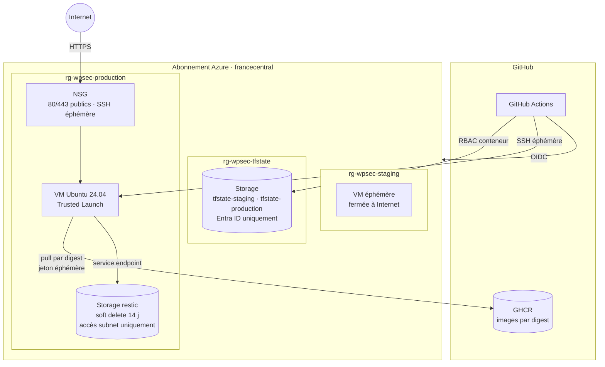
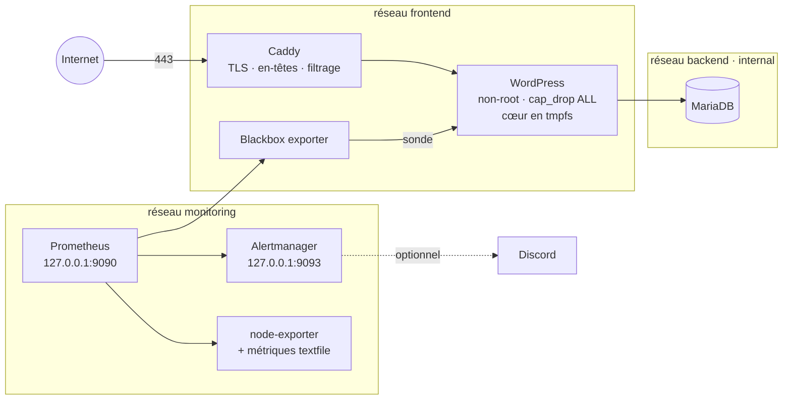

# Architecture

## Vue d'ensemble Azure

Le bootstrap crée **une identité par environnement**. Chacune ne peut :

- obtenir de jeton que depuis un job GitHub rattaché à son environnement : `environment:staging`, ou `environment:production` / `production-ops` ;
- agir que sur son resource group (rôle *Contributor*) ;
- lire et écrire que son conteneur de state (rôle *Storage Blob Data Contributor*).

L'identité de staging ne peut donc ni lire le state de production, qui contient des secrets, ni toucher à ses ressources.

## Stack sur la VM

| Choix | Raison |
|---|---|
| Réseau `backend` en `internal: true` | La base n'a aucun accès sortant et n'est joignable que par WordPress. |
| Cœur WordPress en `tmpfs` | Le cœur est recopié depuis l'image à chaque démarrage. Une modification malveillante de ses fichiers disparaît au redémarrage, et la version qui tourne est celle de l'image scannée. Seul `wp-content` est persistant. |
| WordPress non-root, port 8080 | Le conteneur abandonne toutes les capabilities Linux. |
| Ports de supervision sur `127.0.0.1` | Docker publie ses ports en amont d'ufw. Un port lié à toutes les interfaces serait exposé malgré le pare-feu. On y accède par tunnel SSH (`make tunnel`). |
| Filtrage dans Caddy | `xmlrpc.php`, fichiers sensibles et énumération des comptes (`/wp-json/wp/v2/users`, `?author=`) sont refusés aux visiteurs non authentifiés. |

## Supervision

| Alerte | Déclencheur |
|---|---|
| `WordPressDown` | La sonde interne échoue pendant 1 min. |
| `SiteUnreachableFromInternet` | La sonde HTTPS externe échoue pendant 3 min (production). |
| `TLSCertificateExpiringSoon` | Le certificat expire dans moins de 14 jours. |
| `DiskSpaceLow` | Il reste moins de 15 % d'espace sur `/`. |
| `BackupFailed` / `BackupTooOld` | La dernière sauvegarde a échoué, ou aucune n'a réussi depuis 30 h. |
| `RestoreTestTooOld` | Aucun test de restauration n'a réussi depuis 8 jours. |

Les scripts de sauvegarde et de test écrivent leurs résultats en métriques (collecteur *textfile* de node-exporter).
Un échec silencieux devient ainsi une alerte.

## Sauvegardes

- **Contenu** : dump cohérent de la base (`--single-transaction`) et `wp-content`.
- **Outil** : restic, avec chiffrement côté client, déduplication et rétention 7 jours / 4 semaines / 6 mois.
- **Cible** : Azure Blob, avec un jeton SAS limité au conteneur et une durée de vie bornée (rotation tous les 90 jours).
- **Protection** : le soft delete garde les blobs supprimés pendant 14 jours, même si la VM est compromise. Le compte n'accepte que le trafic du subnet de la VM.
