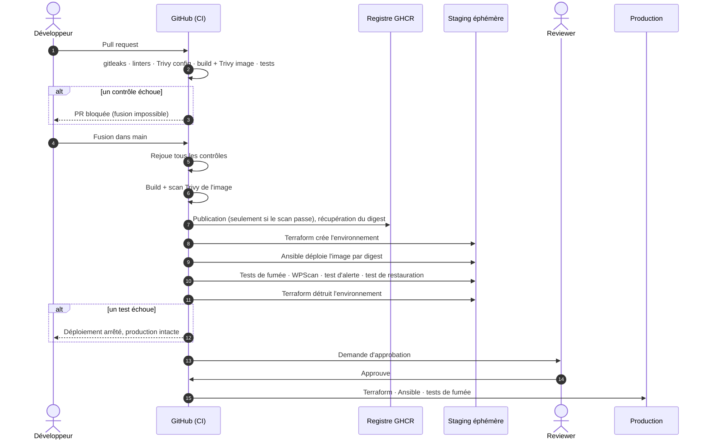

# 1. Vue d'ensemble

## Le problème

Dans beaucoup d'équipes, la sécurité arrive à la fin : un audit avant la mise en production, un scan lancé « quand on a le temps ».
Quand un problème est trouvé à ce stade, il coûte cher à corriger, ou bien il est accepté faute de temps.

Trois défaillances reviennent souvent :

1. **La sécurité est consultative.** Un scanner remonte des alertes, mais rien n'empêche le déploiement.
2. **Ce qui est testé n'est pas ce qui tourne.** On scanne une image, puis on déploie un tag qui a changé entre-temps.
3. **Les filets de sécurité ne sont jamais éprouvés.** Les sauvegardes existent, la supervision existe… jusqu'au jour où l'on découvre qu'elles ne fonctionnaient pas.

## L'objectif

Construire une chaîne de déploiement complète, pour une cible réaliste (un site WordPress sur Azure), dans laquelle :

- **chaque contrôle de sécurité est bloquant** : un échec arrête la chaîne ;
- **l'artefact scanné est exactement celui qui est déployé** ;
- **toute l'infrastructure est décrite en code** et peut être recréée à l'identique ;
- **la supervision et les sauvegardes sont testées automatiquement**, pas seulement configurées.

WordPress n'est pas un choix anodin. C'est le CMS le plus déployé au monde, et l'une des cibles les plus attaquées, principalement via des plugins vulnérables.
Il justifie un scanner spécialisé (WPScan) et un vrai travail de durcissement.

## Le parcours d'un changement

Voici ce qui se passe, concrètement, quand une modification est proposée.

Après le déploiement, deux tâches planifiées continuent de surveiller la production :

- **chaque jour**, l'image en production est rescannée. De nouvelles CVE sont publiées en permanence, et une image saine hier peut être vulnérable aujourd'hui ;
- **chaque semaine**, une sauvegarde fraîche est restaurée et vérifiée.

## Les briques et leur rôle

| Brique | Rôle | Chapitre |
|---|---|---|
| **Terraform** | Décrit l'infrastructure Azure : réseau, VM, stockage, identités. | [2](02-infrastructure-terraform.md) |
| **Ansible** | Configure la VM : durcissement, Docker, application, sauvegardes. | [3](03-configuration-ansible.md) |
| **Docker** | Emballe WordPress dans une image durcie et immuable. | [4](04-image-wordpress.md) |
| **GitHub Actions** | Orchestre la chaîne et applique les contrôles bloquants. | [5](05-pipeline-ci-cd.md) |
| **Trivy** | Scanne les vulnérabilités de l'image et les erreurs de configuration de l'IaC. | [5](05-pipeline-ci-cd.md) |
| **WPScan** | Attaque le WordPress déployé en staging pour y trouver des failles connues. | [5](05-pipeline-ci-cd.md) |
| **Prometheus / Alertmanager** | Surveillent le site et alertent en cas de problème. | [6](06-supervision.md) |
| **restic** | Sauvegarde chiffrée de la base et des fichiers vers Azure. | [7](07-sauvegardes.md) |

## Ce que le projet ne cherche pas à faire

Le périmètre est volontairement limité à **la chaîne de contrôle**. Haute disponibilité, multi-région et mise à l'échelle sont hors sujet.
Une seule VM par environnement suffit à démontrer chaque principe. Les limites sont listées dans le [README](../../README.md#limites-assumées-et-pistes) et le [modèle de menace](08-modele-de-menace.md).
