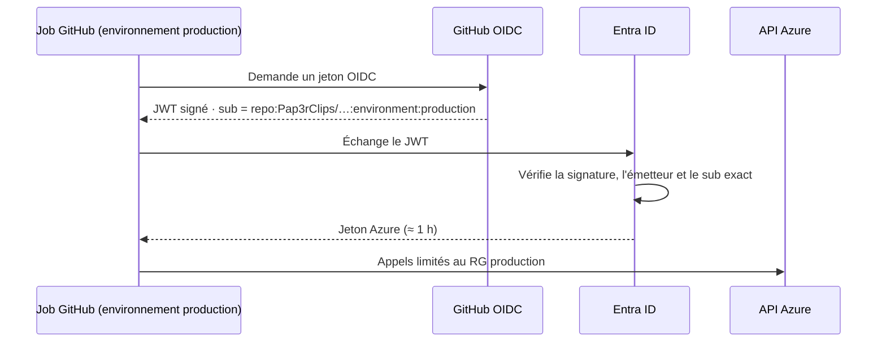

# 2. Infrastructure (Terraform)

Toute l'infrastructure Azure est décrite dans `terraform/`. Rien n'est créé à la main dans le portail.
On peut donc détruire et recréer un environnement à l'identique, ce que le pipeline fait d'ailleurs à chaque déploiement pour le staging.

```
terraform/
├── bootstrap/                  # socle, exécuté une seule fois par un humain
├── modules/wordpress-stack/    # un environnement complet, réutilisable
└── environments/
    ├── staging/                # instancie le module : fermé, éphémère
    └── production/             # instancie le module : public, persistant
```

## 2.1 Le bootstrap : ce qui doit exister avant la CI

La CI a besoin de s'authentifier à Azure et de stocker son state Terraform. Ces deux éléments ne peuvent pas être créés par la CI elle-même : c'est le problème de la poule et de l'œuf.
Le dossier `bootstrap/` est donc exécuté **une seule fois, en local**, par le propriétaire de l'abonnement. Il crée quatre choses.

### Le stockage du state

Terraform garde dans un fichier *state* la correspondance entre le code et les ressources réelles. Ce fichier contient aussi des secrets, comme les mots de passe générés.

| Protection | Pourquoi |
|---|---|
| `shared_access_key_enabled = false` | Les clés d'accès au compte de stockage sont désactivées. Seule l'authentification par identité Entra ID, contrôlée par RBAC, est possible. |
| Un conteneur par environnement | L'identité de staging ne peut pas lire le state de production. |
| Versioning + soft delete 30 jours | On peut revenir à une version précédente du state en cas d'erreur. |

### Les resource groups

`rg-wpsec-staging` et `rg-wpsec-production` sont créés ici, et non par la CI. Ainsi, les identités de CI n'ont des droits que **sur leur resource group**, jamais au niveau de l'abonnement.

### Les identités OIDC

C'est le cœur de la sécurité du pipeline, détaillé dans l'[ADR 0001](../adr/0001-oidc-sans-secret.md).



Pour chaque environnement, le bootstrap crée :

- une application Entra ID et son *service principal* ;
- une ou plusieurs **identités fédérées**, qui disent : « je fais confiance aux jetons GitHub dont le *subject* est exactement `repo:<dépôt>:environment:<env>` » ;
- deux attributions de rôle : *Contributor* sur le resource group de l'environnement, et *Storage Blob Data Contributor* sur son conteneur de state.

Aucun mot de passe n'est créé. Il n'y a donc rien à stocker dans GitHub, et rien à divulguer.

### Les sorties

`terraform output github_variables` affiche les identifiants à reporter dans GitHub. Ce ne sont pas des secrets : ce sont des identifiants publics, comme un nom d'utilisateur sans mot de passe.

## 2.2 Le module `wordpress-stack`

Un module Terraform est une « fonction » d'infrastructure, appelée avec des paramètres. Staging et production utilisent le même module, ce qui garantit qu'ils sont construits de la même façon.

### Réseau

```
VNet 10.20.0.0/16
└── Subnet 10.20.1.0/24  (service endpoint Microsoft.Storage)
    └── NSG
        ├── allow-web-internet   80/443 depuis Internet  (si public_web_access = true)
        ├── allow-ssh-admin      22 depuis des CIDR listés (vide par défaut)
        └── ci-ephemeral-…       ajoutée puis retirée par la CI, hors Terraform
```

Les règles NSG sont des **ressources séparées**, et non des blocs dans le NSG. C'est un détail important.
La CI ajoute une règle temporaire pour l'adresse IP de son runner. Avec des règles déclarées en bloc dans le NSG, Terraform considérerait cette règle comme une dérive et la supprimerait au prochain `apply`.

La variable `admin_ssh_cidrs` refuse explicitement `0.0.0.0/0`, `*` et `Internet` (bloc `validation`). Ouvrir SSH à tout Internet est impossible, même par erreur.

### Machine virtuelle

| Paramètre | Valeur | Raison |
|---|---|---|
| Image | Ubuntu 24.04 LTS | Support long terme, mises à jour de sécurité. |
| Authentification | Clé SSH uniquement | `disable_password_authentication = true`. |
| Trusted Launch | Secure Boot + vTPM | Protection contre les bootkits et rootkits au démarrage. |
| Diagnostics de démarrage | Activés | Console série accessible si la VM ne répond plus. |
| IP publique | Statique, avec label DNS | Donne un FQDN `<label>.francecentral.cloudapp.azure.com`, utilisé pour le certificat TLS. |

### Stockage des sauvegardes

| Protection | Effet |
|---|---|
| `network_rules.default_action = "Deny"` + subnet autorisé | Seule la VM peut joindre le compte. |
| Soft delete (14 jours en production) | Même un attaquant qui contrôlerait la VM ne pourrait pas détruire définitivement les sauvegardes. |
| Jeton SAS limité au conteneur `restic` | La VM n'a jamais la clé du compte. |
| Expiration et rotation du SAS (`time_rotating`) | Le jeton est renouvelé tous les 90 jours, avec 30 jours de marge avant expiration. |

### Secrets applicatifs

Les mots de passe de la base et du compte administrateur, la graine des clés de salage WordPress et le mot de passe du dépôt restic sont générés par `random_password`.
Ils sont exposés en sortie `sensitive`, et lus par la CI pour être transmis à Ansible.

> **Compromis assumé.** Ces secrets vivent dans le state Terraform. Celui-ci est chiffré au repos, accessible uniquement par RBAC et isolé par environnement. L'amélioration naturelle serait Azure Key Vault avec une identité managée sur la VM.

## 2.3 Les environnements

Les deux dossiers `environments/*` sont minces : ils appellent le module avec des paramètres différents et déclarent leur backend.

| Paramètre | Staging | Production |
|---|---|---|
| `public_web_access` | `false` (fermé) | `true` |
| Réplication des sauvegardes | LRS | ZRS (3 zones) |
| Soft delete | 1 jour | 14 jours |
| Durée de vie | quelques minutes | permanente |

Le backend utilise une **configuration partielle** : le nom du compte de stockage n'est pas écrit dans le code, mais fourni par la CI via `-backend-config`. Le code reste ainsi réutilisable d'un abonnement à l'autre.

`resource_provider_registrations = "none"` empêche le provider d'essayer d'enregistrer des services Azure au niveau de l'abonnement. L'identité de CI n'en a pas le droit, et c'est voulu.

## 2.4 Contrôles appliqués à ce code

- `terraform fmt` et `terraform validate` à chaque PR ;
- **Trivy config**, bloquant au-dessus de HIGH ;
- deux exceptions justifiées en commentaire `#trivy:ignore:` au-dessus de la ressource concernée (voir [ADR 0002](../adr/0002-seuils-de-blocage.md)) ;
- **Dependabot**, qui propose les mises à jour des providers.
