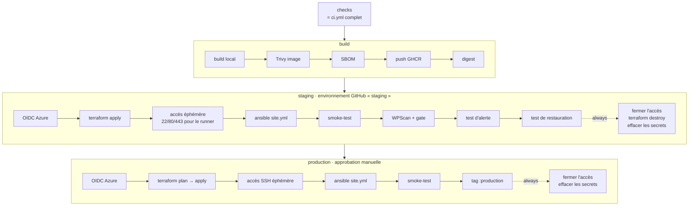

# 5. Pipeline CI/CD

Quatre workflows GitHub Actions, dans `.github/workflows/` :

| Workflow | Déclencheur | Rôle |
|---|---|---|
| `ci.yml` | chaque pull request, et appelé par `cd.yml` | Contrôles statiques bloquants. |
| `cd.yml` | push sur `main`, ou manuel | Build, staging éphémère, production. |
| `restore-test.yml` | chaque lundi, ou manuel | Test de restauration en production. |
| `image-rescan.yml` | chaque jour, ou manuel | Rescan de l'image en production. |

## 5.1 Principes communs à tous les workflows

| Principe | Mise en œuvre |
|---|---|
| **Actions épinglées par SHA** | `uses: actions/checkout@3d3c42e…  # v7.0.1`. Un tag peut être déplacé par un attaquant qui compromet le dépôt d'une action. Un SHA de commit, non. Dependabot propose les mises à jour. |
| **Permissions minimales** | `permissions: contents: read` au niveau du workflow, élargies job par job uniquement si nécessaire (`id-token: write`, `packages: write`, `security-events: write`). |
| **Pas d'identifiants persistés** | `persist-credentials: false` sur chaque checkout : le jeton GitHub n'est pas laissé dans `.git/config`. |
| **Outils épinglés** | Terraform, Python, ansible-core et ansible-lint à des versions exactes, via l'action composite `.github/actions/setup-tools`. |
| **Un seul déploiement à la fois** | `concurrency: cd` sans annulation : deux déploiements ne se chevauchent jamais. |

## 5.2 `ci.yml` : les contrôles statiques

Cinq jobs en parallèle. Ils sont tous déclarés comme *checks requis* sur la branche `main` : un seul échec rend la fusion impossible.

### `secrets` : gitleaks

Analyse **tout l'historique git** (`fetch-depth: 0`) à la recherche de secrets : clés d'API, jetons, clés privées.
Un secret supprimé dans un commit ultérieur reste dans l'historique, donc reste compromis.

### `lint` : qualité

| Outil | Cible | Exemples de problèmes détectés |
|---|---|---|
| `terraform fmt` / `validate` | Terraform | Syntaxe, types, références invalides. |
| `ansible-lint --profile production` | Ansible | Modules non qualifiés, commandes non idempotentes, variables mal nommées. |
| `shellcheck` | Scripts bash | Variables non protégées, `cd` sans contrôle d'erreur. |
| `hadolint` | Dockerfile | Mauvaises pratiques de build. |
| `actionlint` | Workflows | Expressions invalides, injections de script, permissions. |

### `tests` : pytest

Les 16 tests unitaires du gate WPScan (voir 5.4). Un contrôle de sécurité est du code : il se teste comme du code.

### `iac-scan` : Trivy config

Analyse Terraform et le Dockerfile à la recherche de **mauvaises configurations** : stockage public, SSH ouvert, TLS faible, conteneur en root…
Bloquant au-dessus de HIGH. Les résultats sont publiés au format SARIF dans l'onglet *Security → Code scanning*, annotés sur la ligne fautive.

### `image-scan` : build et Trivy image

Construit l'image, sans la publier, puis la scanne pour :

- les **CVE** des paquets ;
- les **secrets** qui auraient été copiés dans l'image.

Le scan est bloquant sur les CVE HIGH et CRITICAL **corrigeables**. Le choix de ce seuil est expliqué dans l'[ADR 0002](../adr/0002-seuils-de-blocage.md).

## 5.3 `cd.yml` : du code à la production

### Job `build` : scanner avant de publier

L'ordre est délibéré :

1. construire l'image **localement** sur le runner ;
2. la **scanner** : si Trivy échoue, le job s'arrête et **rien n'est publié** ;
3. générer un **SBOM** CycloneDX, l'inventaire complet des composants, archivé 90 jours ;
4. **publier** sur GHCR ;
5. récupérer le **digest** `sha256:…`, transmis aux jobs suivants.

Une image vulnérable n'atteint donc jamais le registre, et ce qui est déployé est exactement ce qui a été scanné.

### Job `azure-config` : déploiement conditionnel

Ce job vérifie que les variables Azure du dépôt existent (`AZURE_SUBSCRIPTION_ID`, `AZURE_TENANT_ID`, `TFSTATE_STORAGE_ACCOUNT`).
Si elles sont absentes, les jobs `staging` et `production` sont **ignorés**, et un avertissement est écrit dans le résumé du run. Les contrôles, le build et le scan de l'image s'exécutent quand même.
Les workflows planifiés (`restore-test.yml`, `image-rescan.yml`) utilisent le même mécanisme.
Le projet peut ainsi être forké et vérifié sans abonnement Azure, et le déploiement s'active sans modifier le code.

### Job `staging` : le banc d'essai

Le staging est créé, testé et détruit à chaque exécution ([ADR 0003](../adr/0003-staging-ephemere.md)).

**L'accès éphémère** (`scripts/ephemeral-access.sh`) récupère l'IP publique du runner, puis ajoute une règle NSG nommée `ci-ephemeral-<run_id>` qui n'autorise que cette IP. La règle est retirée en fin de job, même en cas d'échec (`if: always()`).
Aucun port d'administration n'est jamais ouvert à Internet.

**Les tests, dans l'ordre :**

| Test | Vérifie que… |
|---|---|
| `smoke-test.sh` | le site répond en 200, redirige HTTP vers HTTPS, envoie les en-têtes de sécurité, ne divulgue pas sa pile, bloque xmlrpc et l'énumération des comptes. |
| WPScan + gate | aucun plugin, thème ou cœur vulnérable, aucune exposition sensible. |
| `test-monitoring.yml` | une panne déclenche bien une alerte, et que l'alerte se résout ([chapitre 6](06-supervision.md)). |
| `test-restore.yml` | la sauvegarde fraîche est restaurable ([chapitre 7](07-sauvegardes.md)). |

Les étapes finales tournent **toujours** : fermeture de l'accès, `terraform destroy`, effacement des fichiers sensibles.

### Job `production`

- Conditionné au succès du staging. Il ne tourne **jamais** lors d'une démonstration de blocage.
- L'environnement GitHub `production` exige une **approbation manuelle**.
- `terraform plan` est enregistré dans un fichier, puis appliqué tel quel : ce qui est appliqué est ce qui a été affiché.
- Seul SSH est ouvert de façon éphémère, puisque 80/443 sont déjà publics.
- Après les tests de fumée, l'image reçoit le tag `:production`, utilisé par le rescan quotidien.

## 5.4 Le gate WPScan

WPScan remonte les vulnérabilités mais ne fournit pas de code de sortie fiable pour un pipeline. `scripts/wpscan_gate.py` lit son rapport JSON et décide.

**Il bloque si :**

- une vulnérabilité connue touche le cœur, un thème ou un plugin, sauf exception valide ;
- une découverte sensible est présente : XML-RPC actif, `readme.html` exposé, inscription ouverte, listing de répertoire, `debug.log`, sauvegardes ou exports de base exposés… ;
- **l'API de vulnérabilités n'a pas été utilisée.** Sans jeton, WPScan ne trouve aucune vulnérabilité : un rapport vide serait une fausse assurance ;
- une exception de la liste d'autorisation est **expirée** ou **incomplète** ;
- le scan a été interrompu.

Il écrit son verdict dans le résumé du job GitHub (`$GITHUB_STEP_SUMMARY`), lisible sans ouvrir les journaux.

Ses 16 tests unitaires couvrent :

- les cas bloquants, un par motif de blocage ;
- les exceptions valides, expirées et incomplètes ;
- la normalisation des identifiants CVE ;
- le dédoublonnage du thème principal.

## 5.5 Les workflows planifiés

**`restore-test.yml`** utilise l'environnement `production-ops` : même identité Azure que la production, mais sans approbation manuelle, pour pouvoir tourner la nuit.
Il ne lit le state Terraform qu'en lecture (`terraform output`) et n'applique aucun changement d'infrastructure.

**`image-rescan.yml`** n'a pas besoin d'Azure : il lit l'image `:production` sur GHCR et la scanne avec la base de vulnérabilités du jour.
Un échec signale qu'un redéploiement avec une image de base à jour est nécessaire.

## 5.6 Variables et secrets attendus

| Nom | Type | Portée |
|---|---|---|
| `AZURE_TENANT_ID`, `AZURE_SUBSCRIPTION_ID` | variable | dépôt |
| `TFSTATE_RESOURCE_GROUP`, `TFSTATE_STORAGE_ACCOUNT` | variable | dépôt |
| `DNS_LABEL_PREFIX`, `SSH_PUBLIC_KEY`, `ACME_EMAIL` | variable | dépôt |
| `AZURE_CLIENT_ID` | variable | chaque environnement |
| `SSH_PRIVATE_KEY`, `WPSCAN_API_TOKEN` | **secret** | dépôt |
| `ALERT_DISCORD_WEBHOOK` | **secret** (optionnel) | environnement `production` |

Aucun secret Azure : c'est tout l'objet de la fédération OIDC.
