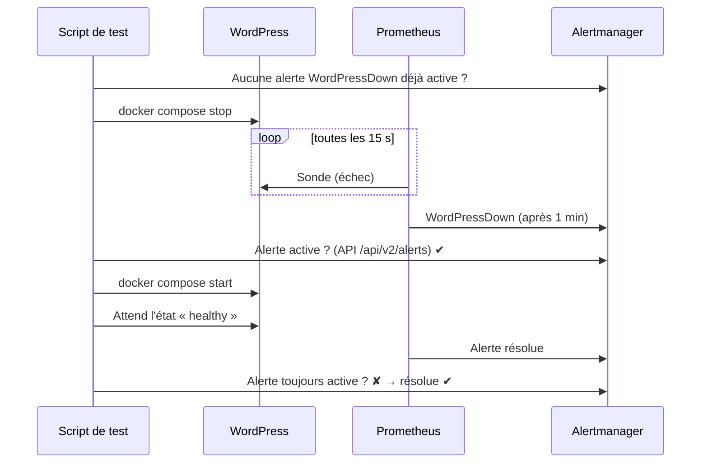

# 6. Supervision

## 6.1 Les composants

Tous tournent en conteneurs sur la VM, dans le même `compose.yml` que l'application.

| Composant | Rôle |
|---|---|
| **Blackbox exporter** | Sonde le site comme le ferait un visiteur, et mesure s'il répond, en combien de temps, et avec quel certificat. |
| **node-exporter** | Métriques de l'hôte (disque, mémoire, CPU), plus les métriques écrites par les scripts de sauvegarde (collecteur *textfile*). |
| **Prometheus** | Collecte les métriques toutes les 15 s, évalue les règles d'alerte, conserve 15 jours d'historique. |
| **Alertmanager** | Regroupe les alertes et les envoie vers Discord, si un webhook est configuré. |

Prometheus et Alertmanager n'écoutent que sur `127.0.0.1`. On y accède par tunnel SSH (`make tunnel HOST=<ip>`), jamais directement depuis Internet.

## 6.2 Les deux sondes

| Sonde | Cible | Ce qu'elle détecte |
|---|---|---|
| **Interne** (`blackbox-internal`) | `http://wordpress:8080/wp-login.php`, avec l'en-tête `Host` du site | WordPress lui-même est en panne, indépendamment du proxy, du DNS et du TLS. |
| **Externe** (`blackbox-external`, production uniquement) | `https://<fqdn>/` | Le site est injoignable depuis l'extérieur (proxy, certificat, NSG), et à quelle date le certificat expire. |

Avoir les deux permet de localiser une panne. Si l'interne est verte et l'externe rouge, le problème est devant WordPress : proxy, certificat ou réseau.

## 6.3 Les alertes

| Alerte | Condition | Sévérité |
|---|---|---|
| `WordPressDown` | sonde interne en échec pendant 1 min | critique |
| `SiteUnreachableFromInternet` | sonde externe en échec pendant 3 min | critique |
| `TLSCertificateExpiringSoon` | certificat expirant dans moins de 14 jours | avertissement |
| `DiskSpaceLow` | moins de 15 % libre sur `/` pendant 10 min | avertissement |
| `TargetDown` | une cible de supervision ne répond plus | avertissement |
| `BackupFailed` | la dernière sauvegarde a échoué | critique |
| `BackupTooOld` | aucune sauvegarde réussie depuis 30 h | critique |
| `RestoreTestTooOld` | aucun test de restauration réussi depuis 8 jours | avertissement |

Les trois dernières **supervisent les sauvegardes elles-mêmes**. Les scripts écrivent un fichier `.prom` dans `/var/lib/node_exporter/textfile/`, que node-exporter expose à Prometheus :

```
wp_backup_last_run_success 1
wp_backup_last_success_timestamp_seconds 1791392207
```

Si le timer de sauvegarde est désactivé, ou si le workflow planifié casse, l'horodatage cesse d'avancer et l'alerte se déclenche. Un échec silencieux devient visible.

## 6.4 Le test qui prouve que tout cela fonctionne

Une règle d'alerte peut être fausse sans que rien ne le signale : une faute dans le nom d'un job, une sonde qui vise la mauvaise URL, un routage mal configuré.
On ne le découvre que le jour de la vraie panne.

`/usr/local/sbin/wp-monitoring-test`, exécuté en staging à chaque déploiement, **provoque une vraie panne** :



Le test vérifie l'alerte **dans Alertmanager** et non dans Discord. Il valide ainsi toute la chaîne interne — sonde → métrique → règle → routage — sans dépendre d'un service externe.
Un `trap` garantit que WordPress est relancé même si le test échoue en cours de route.

## 6.5 Recevoir les alertes

Ajoutez le secret `ALERT_DISCORD_WEBHOOK` sur l'environnement GitHub `production`.
Alertmanager envoie alors les alertes et leurs résolutions sur le salon Discord. Sans webhook, les alertes restent consultables dans Alertmanager.
